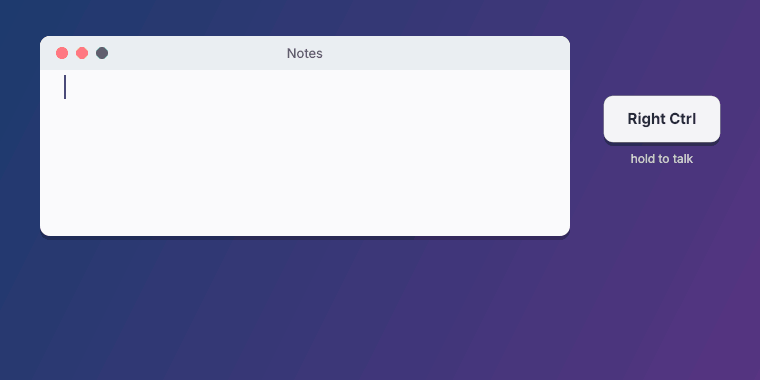

# QwenType

**English** | [简体中文](README.zh-CN.md)

Hold Right Ctrl, speak, release — local Qwen3-ASR voice typing for Windows.



QwenType is a tray-only app for Windows 10/11. While you hold **Right Ctrl**, it streams your microphone to a
[Qwen3-ASR server](https://github.com/dreamyfishmt/fast-qwen-asr-inference-vllm) on your PC or your own server and
shows the live transcript in a small capsule at the bottom of the screen. When you release the key, the text is typed
into the focused app. Shortcuts that use Right Ctrl (Ctrl+C, …) keep working and never start a recording.

- **Hotkey**: Right Ctrl by default. Under **Hotkey** in the tray menu, pick Right Alt / AltGr, Right Shift,
  Caps Lock, Scroll Lock, Pause or a mouse side button instead (Caps Lock, Scroll Lock, Pause and the side buttons are
  then reserved for QwenType and lose their usual function). Turn on **Tap to start, tap to stop** to dictate without
  holding the key. **Esc** cancels the current recording in either mode.
- **Recent** in the tray menu lists the last 10 transcripts; click one to copy it. They are kept in memory only.
  If typing fails, the text is copied to the clipboard so it isn't lost.

- Default language: Auto-detect. QwenType sends no `language` parameter and the model detects the language of
  each utterance. To force one, pick it under **Language** in the tray menu (English, 简体中文, 繁體中文, 日本語,
  한국어); 简体中文 also handles mixed Chinese–English speech, with English words kept in Latin script.
- Optional **LLM Refinement**: an OpenAI-compatible model fixes obvious recognition errors (配森 → Python,
  杰森 → JSON) and nothing else. If it fails or rewrites too much, the unrefined text is used.
- Settings are stored in `%APPDATA%\QwenType\settings.json`, with the server token and the LLM API key encrypted by
  Windows DPAPI. The log is `%APPDATA%\QwenType\qwentype.log`.

## Install the dependencies

You need [uv](https://docs.astral.sh/uv/). It also installs a suitable Python version (3.11+) if necessary.

```powershell
uv sync
```

## Start the ASR server

QwenType only talks to the server over WebSocket/HTTP. It doesn't manage Docker itself. The server has three images
with the same API; see the [server README](https://github.com/dreamyfishmt/fast-qwen-asr-inference-vllm#readme) for
all details.

| Image | Hardware | Use |
|---|---|---|
| `latest-gpu` (recommended) | NVIDIA GPU, driver R580+ (CUDA 13) | Local machine, ~3 GB image |
| `latest-cpu` | Any x86-64 / ARM64 CPU, 2+ GB RAM | Small VPS reached over the internet, **requires a token** |
| vLLM (built locally) | RTX 30 series or newer | Many concurrent users, ~14 GB image |

### GPU on this PC (recommended)

This is the short version of the server's [Quick start: GPU](https://github.com/dreamyfishmt/fast-qwen-asr-inference-vllm#quick-start-gpu-onnx-runtime).

Prerequisites: an NVIDIA GPU with driver R580 or newer, Docker Desktop with the WSL 2 backend, and
[uv](https://docs.astral.sh/uv/) (for `uvx`).

1. Download the model (~2.25 GB):

   ```powershell
   uvx --from huggingface_hub hf download dreamyfishmt/qwen3-asr-1.7b-onnx --local-dir D:/models/qwen3-asr-1.7b-onnx
   ```

   [`dreamyfishmt/qwen3-asr-1.7b-onnx`](https://huggingface.co/dreamyfishmt/qwen3-asr-1.7b-onnx) repackages the embeddings and tokenizer of
   `andrewleech/qwen3-asr-1.7b-onnx` and the int4 decoder of `sorryhyun/qwen3-asr-onnx-gqa` as published. The encoder
   `encoder.fp16.onnx` is an FP16 conversion of andrewleech's FP32 `encoder.onnx`. See the
   [model card](https://huggingface.co/dreamyfishmt/qwen3-asr-1.7b-onnx) for source revisions and validation.

   If the download fails with a 401 from `cas-server.xethub.hf.co` (some proxies block Hugging Face's Xet storage),
   set `$env:HF_HUB_DISABLE_XET = "1"` and run it again.

2. Get [`compose.gpu.yaml`](https://github.com/dreamyfishmt/fast-qwen-asr-inference-vllm/blob/main/compose.gpu.yaml)
   and [`.env.gpu.example`](https://github.com/dreamyfishmt/fast-qwen-asr-inference-vllm/blob/main/.env.gpu.example)
   from the server repository. Without cloning it, run these two commands in an empty folder (in PowerShell, use
   `curl.exe`, not `curl`):

   ```powershell
   curl.exe -LO https://raw.githubusercontent.com/dreamyfishmt/fast-qwen-asr-inference-vllm/main/compose.gpu.yaml
   curl.exe -L -o .env https://raw.githubusercontent.com/dreamyfishmt/fast-qwen-asr-inference-vllm/main/.env.gpu.example
   ```

   This already creates `.env`; just set `MODEL_DIR=D:/models` in it. You can also `git clone` the server repository
   instead, which also has the download script and test samples (then copy `.env.gpu.example` to `.env`); see
   [Quick start: GPU](https://github.com/dreamyfishmt/fast-qwen-asr-inference-vllm#quick-start-gpu-onnx-runtime).

3. Start it (this pulls the image from GHCR) and wait for `provider cuda`, then `Server is ready` in the log:

   ```powershell
   docker compose -f compose.gpu.yaml up -d
   docker compose -f compose.gpu.yaml logs -f
   ```

The server listens on `127.0.0.1:8907`, which is QwenType's default URL, so no token is needed on the same PC.

### CPU server (VPS)

Follow [CPU deployment](https://github.com/dreamyfishmt/fast-qwen-asr-inference-vllm#cpu-deployment) in the server
README (`compose.cpu.yaml`, `.env.cpu.example`). The CPU image **requires** `API_TOKEN`
([Authentication](https://github.com/dreamyfishmt/fast-qwen-asr-inference-vllm#authentication); generate one with
`openssl rand -hex 32`). With a domain and `--profile tls`, Caddy provides HTTPS automatically. Then, in QwenType's
**Settings…** dialog (tab **ASR Server**), fill in:

- **WebSocket URL**: `wss://your-domain/transcribe-streaming` (HTTPS via Caddy, recommended) or
  `ws://SERVER_IP:8907/transcribe-streaming` (unencrypted, trusted networks only)
- **API Token**: the server's `API_TOKEN`

On a CPU server, live partial results only cover the first 20 s of an utterance, and the final result is computed
after you release the key, so it can take a few seconds. Audio beyond `STREAM_MAX_SEC` (60 s on the CPU image) is
dropped by the server; QwenType then stops recording and shows "Server limit … reached".

### vLLM (advanced)

The original vLLM backend is no longer published and builds a ~14 GB image locally. Use it only for many
concurrent users; see [vLLM image (advanced)](https://github.com/dreamyfishmt/fast-qwen-asr-inference-vllm#vllm-image-advanced).

The first tray menu item shows the server state: `ASR: ready`, `ASR: loading_models`, `ASR: offline` or
`ASR: token rejected`.

## Configure the server connection

Open **Settings…** in the tray menu; the **ASR Server** tab has:

- **WebSocket URL**: default `ws://127.0.0.1:8907/transcribe-streaming`; use `wss://…` for a server behind HTTPS.
- **API Token**: the server's `API_TOKEN`, sent as `Authorization: Bearer <token>` and stored encrypted with
  Windows DPAPI. Leave it empty if the server has no token.
- **Hotwords**: optional context (the stream's [`context`](https://github.com/dreamyfishmt/fast-qwen-asr-inference-vllm#ws-transcribe-streaming)) that biases
  recognition toward names and terms, e.g.
  `Vocabulary: Kubernetes, QwenType, 张三`. Keep it short; it is part of every decode. It is also passed to LLM
  refinement as preferred spellings.

**Test** checks `GET /ready` and verifies the token against `GET /health` (`ws://` → `http://`, `wss://` →
`https://`, same host and port), so a wrong token shows up before the first recording.

The **LLM Refinement** tab has the API base URL, key, model and timeout (turn refinement on under **LLM Refinement**
in the tray menu). The **Advanced** tab has:

| Option | Default | |
|---|---|---|
| Max recording | 60 s | Recording stops automatically after this long. |
| Server ready timeout | 5 s | How long to wait for the server to accept a new stream. |
| Final result timeout | 30 s | How long to wait for the final result after release; then the last partial result is used. |
| Paste text longer than | 200 characters | Longer text is pasted via the clipboard instead of typed. |
| Always paste in | (none) | Process names such as `mstsc.exe` that drop typed Unicode input, so text for them is always pasted. |
| Recent transcripts | 10 | Entries in the tray's **Recent** menu; `Off` disables it. |
| Copy the text to the clipboard when typing fails | on | |
| Blur behind the capsule | off | Windows draws the acrylic blur over the whole window rectangle, so it can show as a box. |

**Open Settings Folder** opens `%APPDATA%\QwenType`, which also has the log. The same options are in `settings.json`
(`max_record_seconds`, `ready_timeout_seconds`, `final_timeout_seconds`, `unicode_max_chars`, `clipboard_apps`,
`history_size`, `copy_on_failure`, `capsule_blur`, `hotkey`, `hotkey_mode`); edit the file only while QwenType isn't
running.

## Run and build

`build.ps1` runs every task through uv:

```powershell
.\build.ps1 run       # uv run qwentype
.\build.ps1 build     # uv run pyinstaller qwentype.spec -> dist\QwenType.exe (windowed, single file, trimmed Qt)
.\build.ps1 install   # copies the exe to %LOCALAPPDATA%\Programs\QwenType and adds a "QwenType" Start Menu shortcut
.\build.ps1 clean     # removes build\, dist\ and __pycache__
.\build.ps1 check     # ruff, pyright and the unit tests (what CI runs)
```

If `upx` is on `PATH`, the build uses it. At the end, the build prints the excluded modules, the dropped Qt
files and the final exe size. To start QwenType automatically, use **Start with Windows** in the tray menu.

Development checks (all in the `dev` dependency group):

```powershell
uv run -m unittest discover -s tests -t .   # unit tests
uv run ruff check                           # lint
uv run ruff format                          # format (CI runs `ruff format --check`)
uv run pyright                              # type check
```

`docs/capsule.gif` is rendered from the real capsule code by `uv run python scripts/make_capsule_gif.py`.

GitHub Actions (`.github/workflows/build.yml`) runs ruff and pyright on Linux, and runs the tests and builds
`QwenType.exe` on Windows for every push and pull request; the exe is attached as a workflow artifact (`QwenType-<version>-<commit>.exe`). Pushing a `v*` tag, e.g.
`v1.2.3`, builds with that version (file properties, tray tooltip and log) and publishes `QwenType-v1.2.3.exe` as a
GitHub release.

## Elevated (administrator) windows

Windows doesn't let a normal process send input to an app running as administrator (UIPI). To dictate into
elevated windows, such as an admin terminal or Task Manager, run QwenType as administrator too.

## Build your own

The whole app was generated from [`client-prompt-qwentype.md`](client-prompt-qwentype.md). To build your own
variant, for example with another hotkey, ASR server or platform, edit that prompt and give it to a coding agent.

## Acknowledgements

Thanks to [yetone/voice-input-src](https://github.com/yetone/voice-input-src), whose client prompt this project's
prompt is based on.

## License

Copyright (c) 2026 dreamyfishmt

QwenType is free software: you can redistribute it and/or modify it under the terms of the
[GNU Affero General Public License](LICENSE) as published by the Free Software Foundation, either version 3 of the
License, or (at your option) any later version (`AGPL-3.0-or-later`). It is distributed WITHOUT ANY WARRANTY; see the
license for details.

Earlier versions were released under the MIT License; copies obtained under those terms remain available under MIT.
